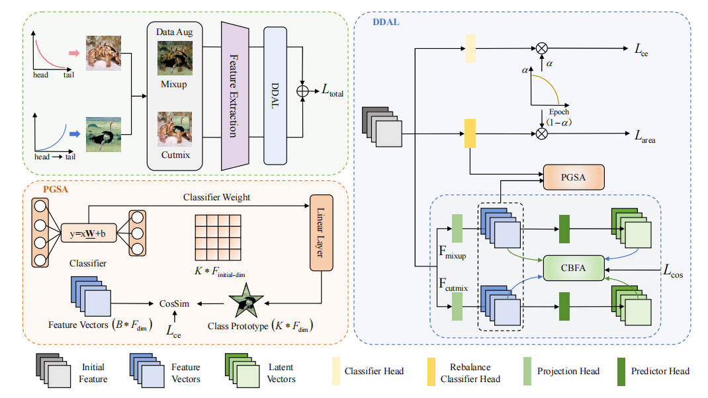

# 🌎 [DDAL] Dynamic Dual Alignment Learning Framework for Long-Tailed Visual Classification
by Nan Chen, Xuehui Sun, Yuan Zheng, Huhe Dai

This is the official implementation of Dynamic Dual Alignment Learning (DDAL) for long-tailed visual classification.


## Overview

<div align="center">
    
</div>

Abstract—Deep neural networks suffer from biased learning on long-tailed data, leading to degraded recognition accuracy for tail classes. Although dual-branch mixed augmentation architectures show potential in this task, we identify an inherent semantic misalignment problem, manifested as semantic divergence between different augmented views and semantic blindness across different task branches within the same view. To address this, we propose a Dynamic Dual Alignment Learning (DDAL) framework consisting of Prototype-Guided Semantic Alignment (PGSA) and Cross-Branch Feature Alignment (CBFA). PGSA utilizes the weight matrix of the rebalanced classification head as dynamic class prototypes to inject high-level semantic information into the contrastive branch, thus alleviating semantic blindness. CBFA enhances feature consistency by guiding multi-level features from different augmented views to approach each other. Furthermore, we introduce an effective-area-aware reweighting strategy that dynamically adjusts loss weights based on the actual distribution range of classes in the feature space, providing balanced supervision signals. Experiments on multiple long-tailed benchmark datasets, including CIFAR-10-LT, CIFAR-100-LT, ImageNet-LT, and Places-LT, demonstrate the superiority of DDAL compared to existing state-of-the-art methods.


## Getting Started
### Environment
All codes are written by Python 3.9 with

- PyTorch = 1.12.1
- torchvision = 0.13.1
- numpy = 1.26.1

### Install

Create a  virtual environment and activate it.

```shell
conda create -n my_DDAL python=3.9
conda activate my_DDAL
```

```shell
pip install -r requirements.txt
```

### Preparing Datasets
Download the datasets CIFAR-10, CIFAR-100, ImageNet, and places to DDAL-main/data. The directory should look like

```Shell
DDAL-main/data
├── CIFAR-100-python
├── CIFAR-10-batches-py
├── data_txt
|   └── Places_LT_train.txt
|   └── Places_LT_val.txt
|   └── ImageNet_LT_val.txt
|   └── ImageNet_LT_train.txt
├── ImageNet
|   └── test
|   └── train
|   └── val
└── places

    
```
### Training

for CIFAR-10-LT
````Shell
python main.py --dataset cifar10 -a resnet32 --num_classes 10 --imbanlance_rate 0.1 --beta 0.5 --lr 0.01 --epochs 200 -b 64 --momentum 0.9 --weight_decay 5e-3 --resample_weighting 0.0 --label_weighting 1.0 --contrast_weight 2   --center_weight 1 --rho 0.05

python main.py --dataset cifar10 -a resnet32 --num_classes 10 --imbanlance_rate 0.02 --beta 0.5 --lr 0.01 --epochs 200 -b 64 --momentum 0.9 --weight_decay 5e-3 --resample_weighting 0.0 --label_weighting 1.2 --contrast_weight 4 --center_weight 1 --rho 0.05

python main.py --dataset cifar10 -a resnet32 --num_classes 10 --imbanlance_rate 0.01 --beta 0.5 --lr 0.01 --epochs 200 -b 64 --momentum 0.9 --weight_decay 5e-3 --resample_weighting 0.2 --label_weighting 1.2  --contrast_weight 4 --center_weight 1 --rho 0.05
````

for CIFAR-100-LT
````Shell
python main.py --dataset cifar100 -a resnet32 --num_classes 100 --imbanlance_rate 0.1 --beta 0.5 --lr 0.01 --epochs 200 -b 64 --momentum 0.9 --weight_decay 5e-3 --resample_weighting 0.0 --label_weighting 1.2  --contrast_weight 4 --center_weight 1 --rho 0.05

python main.py --dataset cifar100 -a resnet32 --num_classes 100 --imbanlance_rate 0.02 --beta 0.5 --lr 0.01 --epochs 200 -b 64 --momentum 0.9 --weight_decay 5e-3 --resample_weighting 0.2  --label_weighting 1.2  --contrast_weight 6 --center_weight 1 --rho 0.05

python main.py --dataset cifar100 -a resnet32 --num_classes 100 --imbanlance_rate 0.01 --beta 0.5 --lr 0.01 --epochs 200 -b 64 --momentum 0.9 --weight_decay 5e-3 --resample_weighting 0.2  --label_weighting 1.2  --contrast_weight 4 --center_weight 1 --rho 0.05
````


for ImageNet-LT
````Shell
python main.py --dataset ImageNet-LT -a resnext50_32x4d --num_classes 1000 --beta 0.5 --lr 0.1 --epochs 135 -b 120 --momentum 0.9 --weight_decay 2e-4 --resample_weighting 0.2 --label_weighting 1.0 --contrast_weight 10 --center_weight 0.5 --rho 0.05 --root "data/ImageNet" --dir_test_txt "data/data_txt/ImageNet_LT_test.txt" --dir_train_txt "data/data_txt/ImageNet_LT_train.txt" 
````

for iNaturelist2018 
````Shell
python main.py --dataset Places-LT -a resnet152 --num_classes 365 --beta 0.5 --lr 0.01 --epochs 30 -b 128 --momentum 0.9 --weight_decay 1e-4 --resample_weighting 0.0 --label_weighting 1.0 --contrast_weight 10 --center_weight 0.7 --rho 0.05 --root "data/places" --dir_test_txt "data/data_txt/Places_LT_val.txt" --dir_train_txt 'data/data_txt/Places_LT_train.txt' 
````

### Testing
````Shell
python test.py --dataset ImageNet-LT -a resnext50_32x4d --num_classes 1000 --resume model_path
````

## Result

| Datasets | IF | Model | Top-1 Acc(%) |
| :---:| :---:|:---:|:---:|
| CIFAR-10-LT   | 100   | ResNet-32     | 90.25%    |
| CIFAR-10-LT   | 50    | ResNet-32     | 92.39%    |
| CIFAR-10-LT   | 10    | ResNet-32     | 95.65%    |
| CIFAR-100-LT   | 100   | ResNet-32     | 59.86%    |
| CIFAR-100-LT   | 50    | ResNet-32     | 64.39%    |
| CIFAR-100-LT   | 10    | ResNet-32     | 74.63%    |
| ImageNet-LT   | 100   | ResNext-50_32x4d     | 57.56%    |
| Places-LT   | 100   | ResNet-152     | 41.25%    |


